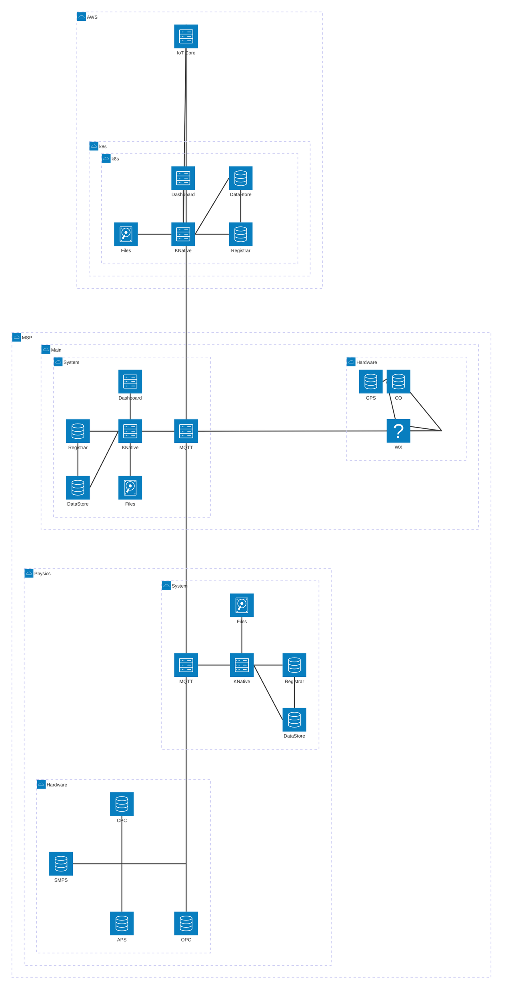

```mermaid
architecture-beta
    group aws(cloud)[AWS]
    group k8s(cloud)[k8s] in aws
    group system(cloud)[k8s] in k8s

    group msp(cloud)[MSP]


    service iotcore(server)[IoT Core] in aws
    service knmqtt(server)[KNative] in system
    service filemanager(disk)[Files] in system
    service datastore(database)[DataStore] in system
    service registrar(database)[Registrar] in system
    service dashboard(server)[Dashboard] in system
    junction junctionCenter in system


    group payload01(cloud)[Main] in msp
    group hardware01(cloud)[Hardware] in payload01
    group system01(cloud)[System] in payload01

    group payload03(cloud)[Physics] in msp
    group hardware03(cloud)[Hardware] in payload03
    group system03(cloud)[System] in payload03

    service cpc(database)[CPC] in hardware03
    service smps(database)[SMPS] in hardware03
    service opc(database)[OPC] in hardware03
    service aps(database)[APS] in hardware03
    junction junctionCenter03 in hardware03
    junction junctionRight03 in hardware03

    service mqtt03(server)[MQTT] in system03
    service knmqtt03(server)[KNative] in system03
    service filemanager03(disk)[Files] in system03
    service datastore03(database)[DataStore] in system03
    service registrar03(database)[Registrar] in system03

    service gps(database)[GPS] in hardware01
    service wx(mdi:thermometer)[WX] in hardware01
    service co(database)[CO] in hardware01
    junction junctionCenter01 in hardware01


    service mqtt01(server)[MQTT] in system01
    service knmqtt01(server)[KNative] in system01
    service filemanager01(disk)[Files] in system01
    service datastore01(database)[DataStore] in system01
    service registrar01(database)[Registrar] in system01
    service dashboard01(server)[Dashboard] in system01


    mqtt01:T -- B:iotcore
    knmqtt:B -- T:iotcore
    knmqtt:R -- L:datastore
    knmqtt:T -- B:dashboard
    knmqtt:L -- R:filemanager
    datastore:B -- T:registrar
    registrar:L -- R:knmqtt


    cpc:B -- T:junctionCenter03
    smps:R -- L:junctionCenter03
    aps:T -- B:junctionCenter03
    junctionCenter03:R -- L:junctionRight03
    opc:T -- B:junctionRight03
    junctionRight03:T -- B:mqtt03

    mqtt03:T -- B:mqtt01
    mqtt03:R -- L:knmqtt03
    knmqtt03:T -- B:filemanager03
    knmqtt03:R -- L:datastore03
    knmqtt03:R -- L:registrar03
    datastore03:T -- B:registrar03

    gps:R -- T:junctionCenter01
    wx:L -- R:junctionCenter01
    co:L -- T:junctionCenter01
    junctionCenter01:L -- R:mqtt01

    mqtt01:L -- R:knmqtt01
    knmqtt01:B -- T:filemanager01
    knmqtt01:L -- R:datastore01
    knmqtt01:L -- R:registrar01
    datastore01:T -- B:registrar01
    knmqtt01:T -- B:dashboard01

```